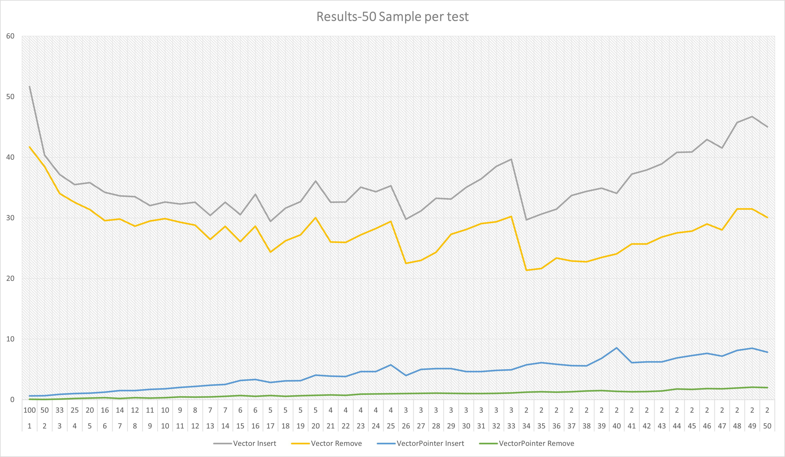

# CPP AP Project

***
## Part 1 
This part compair two vector class. They are using two methods for making the vector class. One use single pointer (T*) and the other use double pointer(T**). I test both of them and compair them to std::vector from c++ compiler.

I test them with 100\*1MB objects to 2\*50MB objects. The vector allways is 100 MB. As you could see the winner is std::vector and Vector with double pointer is close to it. But the Vector with single pointer is farway from them.

A close look at the grpahs shows us the speed of vector with (T\*) is more dependent on counts but the vector with (T**) is dependent on object size.

In this results we could see the Vector pointer sometime is even faster than std::vector but the std::vector is faster in totaly. I think it becasue of capacity that use and alocata more memory. in the cases that capacity filled up it is slower.
***
## Part 2

In this part I just made a Device class that holds two vectors of shapes and itself. I make oprator<< function for every thing. You could test it by yourself. (A main sample located in Part2 folder).

***
## Compile
The code could compile in g++ and MSVC.
if you don't want to compile but you want to test you could download this releases

[Part1.exe](https://github.com/mdaneshyab/CPP-AP-Project/releases/download/v1.0.0/Part1.exe)
[Part2.exe](https://github.com/mdaneshyab/CPP-AP-Project/releases/download/v1.0.0/Part2.exe)

